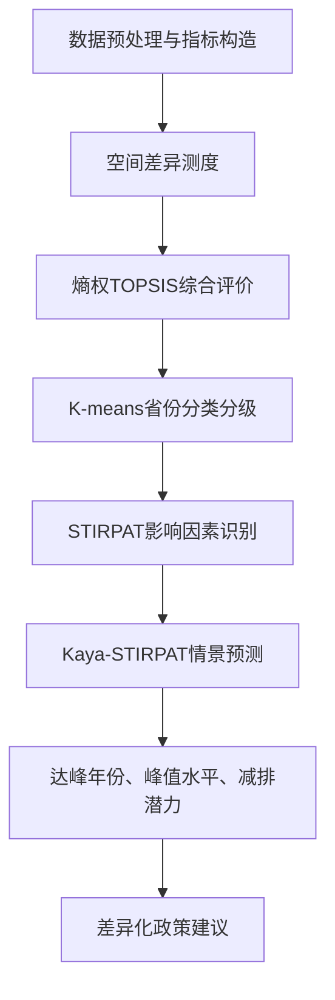

# B题建模实现思路：统计评价、聚类分型、STIRPAT识别与情景预测

## 1. 题目理解与数据口径

B题要求围绕“我国碳排放时空特征分析与趋势预测”完成四个任务：

1. 分析省际碳排放空间差异，建立分类分级模型；
2. 识别碳排放影响因素，构建预测模型并完成参数估计与检验；
3. 设置基准、低碳、强化低碳三种情景，预测2026至2045年排放趋势并研判达峰；
4. 根据模型结论形成约500字政策建议报告。

本项目当前数据可分为两类：

| 数据文件 | 当前字段与用途 | 建议用途 |
|---|---|---|
| `数据/附件1：2019—2025 年全国碳排放数据.csv` | `Area, CO2 (Mt), Sector, Date`，实际为全国部门日度或月度口径，`Area`仅为 China | 用于全国时间趋势、部门结构、2026至2045情景预测 |
| `数据/附件2：2022 年全国 30 个省份碳排放清单.xlsx` | 30个省份、分能源与分部门CO2清单 | 用于省际空间差异、能源结构与行业结构分析 |
| `数据/2022省级综合表.xlsx` | 已合并人口、GDP、第二产业、城镇化、排放强度、煤炭占比等指标 | 作为问题一和问题二横截面建模主表 |
| `数据/全国数据.xlsx` | 2019至2024年全国GDP、人口、能源消费总量、煤炭占比 | 用于Kaya/STIRPAT情景变量外推 |

需要在论文中说明：附件1的2025年数据截至2025-09-30，直接年度求和会低估全年排放，因此用于年度趋势时应采取“剔除2025年”或“对2025年年化处理”。

## 2. 总体建模路线

推荐采用“描述统计差异分析 + 熵权TOPSIS综合评价 + K-means聚类分型 + STIRPAT驱动因素识别 + Kaya-STIRPAT情景预测”的主线。

这条路线的优点是四个问题之间衔接自然：问题一给出省份类型，问题二解释驱动因素，问题三预测趋势，问题四按类型和驱动因素提出政策。

## 3. 问题一：空间差异分析与省份分类分级

### 3.1 指标体系

基于`2022省级综合表.xlsx`构建指标体系：

| 维度 | 指标 | 属性 | 含义 |
|---|---|---|---|
| 排放规模 | CO2总量 | 负向 | 省份直接排放规模 |
| 排放效率 | 人均CO2、碳排放强度 | 负向 | 居民排放压力与经济产出排放压力 |
| 能源结构 | 煤炭相关排放占比 | 负向 | 对煤炭依赖程度 |
| 产业结构 | 第二产业占比 | 负向 | 工业化与高耗能产业压力 |
| 经济发展 | 人均GDP、城镇化率 | 正向 | 经济发展水平与低碳治理能力 |

核心指标计算：

$$
PC_i=\frac{C_i}{P_i}
$$

$$
CI_i=\frac{C_i}{GDP_i}
$$

其中，$C_i$为第$i$省碳排放总量，$P_i$为人口，$GDP_i$为地区生产总值，$PC_i$为人均碳排放，$CI_i$为碳排放强度。

### 3.2 空间差异测度模型

使用变异系数、基尼系数和泰尔指数刻画省际差异。

变异系数：

$$
CV=\frac{\sigma}{\mu}
$$

基尼系数：

$$
G=\frac{2\sum_{i=1}^{n}ix_i}{n\sum_{i=1}^{n}x_i}-\frac{n+1}{n}
$$

泰尔指数：

$$
T=\frac{1}{n}\sum_{i=1}^{n}\frac{x_i}{\bar{x}}\ln\left(\frac{x_i}{\bar{x}}\right)
$$

### 3.3 初步结果

根据当前`2022省级综合表.xlsx`计算，得到以下初步结果：

| 指标 | 均值 | 变异系数 | 基尼系数 | 泰尔指数 | 最小值 | 最大值 |
|---|---:|---:|---:|---:|---:|---:|
| CO2总量_Mt | 380.2822 | 0.6458 | 0.3549 | 0.2041 | 44.6919 | 920.9053 |
| 人均CO2_吨每人 | 9.8017 | 0.7957 | 0.3513 | 0.2312 | 3.2763 | 36.6002 |
| 碳排放强度_吨每万元GDP | 1.3011 | 0.7958 | 0.3883 | 0.2555 | 0.1720 | 4.8805 |
| 煤炭相关排放占比 | 0.7113 | 0.2510 | 0.1263 | 0.0447 | 0.0212 | 0.9399 |

解释：

1. 省际排放总量存在明显不均衡，CO2总量基尼系数约为0.355；
2. 排放强度差异更突出，基尼系数约为0.388，说明不同省份单位经济产出的碳排放压力差别更大；
3. 煤炭占比的基尼系数较小，但均值高达0.711，说明煤炭依赖是较普遍的问题，只是不同省份程度不同。

高排放省份主要包括山东、内蒙古、河北、江苏、山西、广东、河南、辽宁。其中山东、河北、江苏、广东属于经济和工业规模驱动，内蒙古、山西、新疆、宁夏则表现为资源依赖和高强度排放特征。

### 3.4 熵权TOPSIS综合评价

第一步，对正向和负向指标标准化：

$$
z_{ij}=\frac{x_{ij}-\min x_j}{\max x_j-\min x_j}
$$

$$
z_{ij}=\frac{\max x_j-x_{ij}}{\max x_j-\min x_j}
$$

第二步，计算指标比重：

$$
p_{ij}=\frac{z_{ij}}{\sum_{i=1}^{n}z_{ij}}
$$

第三步，计算熵值：

$$
e_j=-\frac{1}{\ln n}\sum_{i=1}^{n}p_{ij}\ln p_{ij}
$$

第四步，计算权重：

$$
w_j=\frac{1-e_j}{\sum_{j=1}^{m}(1-e_j)}
$$

第五步，计算TOPSIS贴近度：

$$
S_i=\frac{D_i^-}{D_i^++D_i^-}
$$

其中$S_i$越大，表示低碳发展综合表现越好。

当前数据得到的熵权如下：

| 指标 | 权重 |
|---|---:|
| CO2总量_Mt | 0.1124 |
| 人均CO2_吨每人 | 0.0543 |
| 碳排放强度_吨每万元GDP | 0.0493 |
| 煤炭相关排放占比 | 0.2215 |
| 第二产业占比 | 0.1181 |
| 人均GDP_万元每人 | 0.2728 |
| 城镇化率_% | 0.1717 |

TOPSIS低碳得分排名靠前省份：

| 省份 | 得分 |
|---|---:|
| 北京 | 0.978 |
| 上海 | 0.738 |
| 天津 | 0.586 |
| 海南 | 0.515 |
| 浙江 | 0.497 |
| 福建 | 0.491 |
| 重庆 | 0.489 |
| 广东 | 0.471 |

排名靠后省份：

| 省份 | 得分 |
|---|---:|
| 山西 | 0.248 |
| 内蒙古 | 0.251 |
| 新疆 | 0.255 |
| 河北 | 0.255 |
| 宁夏 | 0.283 |
| 河南 | 0.327 |
| 山东 | 0.331 |
| 甘肃 | 0.345 |

结果说明：北京、上海等经济发达地区低碳得分较高，主要得益于较低排放强度、较高人均GDP和较高城镇化水平；山西、内蒙古、新疆、宁夏等地区得分偏低，主要受煤炭占比高、人均排放高和排放强度高影响。

### 3.5 K-means聚类分类

聚类输入变量建议为：

$$
X_i=(C_i, PC_i, CI_i, Coal_i, IS_i, A_i, U_i)
$$

其中$Coal_i$为煤炭相关排放占比，$IS_i$为第二产业占比，$A_i$为人均GDP，$U_i$为城镇化率。

采用标准化后的K-means模型：

$$
\min \sum_{k=1}^{K}\sum_{i\in G_k}\|X_i-\mu_k\|^2
$$

模型选择可结合肘部法和轮廓系数。当前数据下，轮廓系数为：

| K | 轮廓系数 |
|---:|---:|
| 2 | 0.349 |
| 3 | 0.405 |
| 4 | 0.284 |
| 5 | 0.282 |
| 6 | 0.312 |

从纯统计角度，K=3更优；从政策解释角度，K=4能更细致区分“工业制造高排放型”和“一般转型型”，因此论文中可采用K=4，并说明该选择兼顾轮廓系数和政策解释性。

K=4的可解释分类如下：

| 类型 | 省份 | 主要特征 | 政策含义 |
|---|---|---|---|
| 资源依赖高排放型 | 山西、内蒙古、宁夏、新疆 | 人均排放约27.235吨/人，强度约3.521吨/万元GDP，煤炭占比约0.912 | 控煤、煤电灵活改造、资源型产业转型 |
| 工业制造高排放型 | 天津、河北、辽宁、江苏、浙江、福建、山东、广东、陕西 | 总量均值约558.657 Mt，工业和制造业贡献明显 | 重点行业节能改造，钢铁、建材、电力减排 |
| 中等转型压力型 | 吉林、黑龙江、安徽、江西、河南、湖北、湖南、广西、海南、重庆、四川、贵州、云南、甘肃、青海 | 总量和强度居中，发展阶段差异较大 | 分区推进产业升级和能源替代 |
| 经济发达效率型 | 北京、上海 | 强度低，人均GDP和城镇化率高，煤炭占比低 | 以技术创新、服务业低碳化、消费端减排为主 |

## 4. 问题二：影响因素识别与预测模型构建

### 4.1 可选模型

| 模型 | 适用场景 | 优点 | 局限 |
|---|---|---|---|
| STIRPAT模型 | 识别人口、经济、技术、能源结构等因素影响 | 解释性强，符合题意 | 需要足够样本，变量共线性需处理 |
| 多元线性回归 | 横截面或年度数据拟合 | 简单直观，可做显著性检验 | 非线性刻画较弱 |
| 岭回归 | 指标存在共线性时 | 稳定系数，提升泛化 | 系数解释不如OLS直接 |
| LASSO回归 | 候选变量较多时筛选变量 | 可做变量选择 | 小样本下不稳定 |
| 随机森林、XGBoost | 追求预测精度 | 能刻画非线性 | 解释性较弱，样本量要求较高 |
| 灰色预测GM(1,1) | 年度序列很短时 | 小样本可用 | 难解释驱动因素 |

综合题目要求和现有数据，推荐以STIRPAT为主模型，岭回归作为优化模型，Kaya恒等式作为情景预测的结构约束。

### 4.2 STIRPAT模型设定

STIRPAT模型为：

$$
I=aP^bA^cT^d e
$$

取对数后得到：

$$
\ln C_i=\alpha+\beta_1\ln P_i+\beta_2\ln A_i+\beta_3 Coal_i+\beta_4 IS_i+\beta_5 U_i+\varepsilon_i
$$

变量含义：

| 符号 | 指标 |
|---|---|
| $C_i$ | 第$i$省CO2总量 |
| $P_i$ | 人口规模 |
| $A_i$ | 人均GDP |
| $Coal_i$ | 煤炭相关排放占比 |
| $IS_i$ | 第二产业占比 |
| $U_i$ | 城镇化率 |

如果后续能补充2010至2024年省级面板数据，建议升级为双向固定效应模型：

$$
\ln C_{it}=\alpha_i+\gamma_t+\beta X_{it}+\varepsilon_{it}
$$

其中$\alpha_i$控制省份不可观测差异，$\gamma_t$控制年度冲击。

### 4.3 当前横截面回归初步结果

基于30省2022年横截面数据，拟合：

$$
\ln C=\alpha+\beta_1\ln P+\beta_2\ln A+\beta_3 Coal+\beta_4 IS+\beta_5 U+\varepsilon
$$

得到初步OLS结果：

| 指标 | 系数 | t统计量 |
|---|---:|---:|
| 常数项 | -3.2736 | -3.66 |
| lnP | 0.6447 | 7.99 |
| lnA | 0.4502 | 1.17 |
| 煤炭相关排放占比 | 2.8275 | 4.88 |
| 第二产业占比 | 0.5080 | 0.44 |
| 城镇化率 | 0.8029 | 0.60 |

拟合优度：

| 指标 | 数值 |
|---|---:|
| $R^2$ | 0.8762 |
| 调整$R^2$ | 0.8504 |
| RMSE_log | 0.2672 |

解释：

1. 人口规模和煤炭相关排放占比是当前横截面中最显著的正向驱动因素；
2. 人均GDP、第二产业占比和城镇化率系数为正，但在当前样本下显著性弱，可能与变量间相关性和样本量有限有关；
3. 模型$R^2$较高，说明对2022年省际排放差异具有较好解释力，但不能直接等同于长期因果关系。

共线性检验VIF：

| 变量 | VIF |
|---|---:|
| lnP | 1.21 |
| lnA | 6.57 |
| 煤炭相关排放占比 | 3.60 |
| 第二产业占比 | 2.95 |
| 城镇化率 | 5.31 |

VIF均小于10，说明不存在严重多重共线性；但人均GDP和城镇化率VIF偏高，论文中可说明使用岭回归进行稳健性优化。

岭回归留一交叉验证结果：

| 指标 | 数值 |
|---|---:|
| 最优$\lambda$ | 2.1967 |
| 留一交叉验证$R^2$ | 0.8037 |
| RMSE_log | 0.3364 |
| MAE_log | 0.2565 |

标准化岭回归系数绝对值排序：

| 变量 | 标准化系数 |
|---|---:|
| lnP | 0.4472 |
| 煤炭相关排放占比 | 0.4102 |
| lnA | 0.1095 |
| 第二产业占比 | 0.1037 |
| 城镇化率 | 0.0836 |

该结果与OLS结论一致：人口规模和煤炭依赖是最稳定的关键驱动因素。

## 5. 问题三：多情景趋势预测与达峰研判

### 5.1 为什么建议使用Kaya-STIRPAT组合

现有全国年度辅助变量只有2019至2024年，样本点较少；如果直接用全国年度数据估计包含多个变量的STIRPAT模型，参数会不稳定。因此建议：

1. 用省级横截面STIRPAT识别关键驱动因素；
2. 用全国时间序列刻画总量趋势和部门结构；
3. 用Kaya恒等式约束情景预测，使预测变量具有清晰物理含义。

Kaya恒等式可写为：

$$
C=P\times \frac{GDP}{P}\times \frac{E}{GDP}\times \frac{C}{E}
$$

其中：

| 因子 | 含义 |
|---|---|
| $P$ | 人口规模 |
| $GDP/P$ | 人均经济水平 |
| $E/GDP$ | 能源强度 |
| $C/E$ | 能源碳强度 |

情景预测时，只需设定人口、人均GDP、能源强度、能源碳强度的未来变化率，即可预测全国CO2排放。

### 5.2 全国排放趋势初步结果

附件1中应只使用`Sector=Total`作为全国总量，不能把Total和各部门重复求和。当前年度总量为：

| 年份 | CO2总量_Mt |
|---:|---:|
| 2019 | 11148.50 |
| 2020 | 11193.00 |
| 2021 | 11619.03 |
| 2022 | 11627.06 |
| 2023 | 11952.40 |
| 2024 | 11901.44 |
| 2025 | 8615.64 |

说明：2025年仅截至9月30日，不能直接与全年数据比较。

2024年部门排放结构中，`Total`为11901.44 Mt；如果仅看分部门贡献，工业约5093.00 Mt，电力约4988.78 Mt，地面交通约1122.07 Mt，居民约606.60 Mt。工业和电力是全国排放的主体。

### 5.3 情景参数设定

以2024年全国排放11901.44 Mt为基准，设置三类情景。以下参数为论文可采用的示例，最终可结合政策目标和统计年鉴进一步调整。

| 情景 | 2025至2030人口 | 2025至2030人均GDP | 2025至2030能源强度 | 2025至2030能源碳强度 | 2031至2045人口 | 2031至2045人均GDP | 2031至2045能源强度 | 2031至2045能源碳强度 |
|---|---:|---:|---:|---:|---:|---:|---:|---:|
| 基准情景 | -0.1% | 4.5% | -3.0% | -1.0% | -0.1% | 3.0% | -2.8% | -1.2% |
| 低碳情景 | -0.1% | 4.2% | -3.8% | -1.8% | -0.1% | 2.8% | -3.5% | -2.0% |
| 强化低碳情景 | -0.1% | 4.0% | -4.8% | -2.8% | -0.1% | 2.6% | -4.2% | -3.0% |

年度递推公式：

$$
C_{t+1}=C_t(1+g_P)(1+g_A)(1+g_{EI})(1+g_{CI})
$$

其中$g_P$为人口增长率，$g_A$为人均GDP增长率，$g_{EI}$为能源强度变化率，$g_{CI}$为能源碳强度变化率。

### 5.4 示例预测结果

基于上述参数得到的示例结果：

| 情景 | 达峰年份 | 峰值_Mt | 2030年_Mt | 2035年_Mt | 2045年_Mt | 2045较峰值下降 |
|---|---:|---:|---:|---:|---:|---:|
| 基准情景 | 2030 | 12082 | 12082 | 11383 | 10105 | 16.4% |
| 低碳情景 | 2024 | 11901 | 10763 | 9300 | 6944 | 41.7% |
| 强化低碳情景 | 2024 | 11901 | 9397 | 7367 | 4527 | 62.0% |

结果解释：

1. 基准情景下，排放总量在2030年前后达到高位平台，并在2030年后缓慢下降，符合“2030年前碳达峰”的政策目标；
2. 低碳情景下，由于能源强度下降和能源碳强度下降更快，排放在2024后进入下降通道；
3. 强化低碳情景下降幅最大，说明技术进步、能源替代和产业升级对中长期减排有决定性作用。

注意：上述结果是基于示例情景参数的实现思路，最终论文应对参数来源进行说明，并进行敏感性分析。

## 6. 问题四：政策建议的写法

政策建议应与分类和预测结论对应，不宜泛泛而谈。可以按以下结构写成单独页面。

1. 对资源依赖高排放型省份，重点控制煤炭消费总量，推进煤电灵活性改造和新能源替代，发展煤化工低碳化与碳捕集利用封存技术；
2. 对工业制造高排放型省份，聚焦钢铁、建材、电力、石化等行业，推动节能改造、余热利用、电气化替代和绿色供应链管理；
3. 对中等转型压力型省份，优先提升能源利用效率，承接产业转移时设置碳强度约束，避免高耗能产业简单转移；
4. 对经济发达效率型省份，发挥技术创新和服务业优势，推进绿色金融、碳交易、低碳消费和数字化碳管理；
5. 从全国层面看，应加快非化石能源替代，降低能源强度和能源碳强度，这是情景预测中提前达峰和降低峰值的核心路径。

## 7. 模型检验与稳健性分析

| 模型环节 | 检验方法 | 本项目建议 |
|---|---|---|
| 描述统计 | 极值、均值、标准差、变异系数 | 检查省份差异是否显著，识别异常值 |
| 空间差异 | 基尼系数、泰尔指数 | 可进一步按东中西东北分解泰尔指数 |
| 熵权TOPSIS | 权重稳定性检验 | 删除单个指标或改变正负向设定，观察排名变化 |
| 聚类模型 | 肘部法、轮廓系数 | K=3统计效果更好，K=4政策解释更细 |
| STIRPAT回归 | $R^2$、调整$R^2$、t检验、残差分析 | 当前OLS调整$R^2$约0.8504 |
| 共线性 | VIF检验 | 当前变量VIF均小于10 |
| 预测模型 | 留一交叉验证、RMSE、MAE | 岭回归LOOCV的$R^2$约0.8037 |
| 情景预测 | 参数敏感性分析 | 对能源强度下降率、能源碳强度下降率上下浮动10% |

## 8. 可直接落地的代码实现步骤

### 8.1 数据预处理

1. 读取`2022省级综合表.xlsx`主表；
2. 检查30个省份是否完整，保留缺失值统计；
3. 构造人均CO2、碳排放强度、第二产业占比、煤炭相关排放占比；
4. 读取附件1时，只用`Sector=Total`计算全国排放总量。

### 8.2 问题一代码流程

1. 对CO2总量、人均CO2、碳排放强度、煤炭占比计算描述统计；
2. 编写函数计算变异系数、基尼系数和泰尔指数；
3. 对评价指标做极差标准化；
4. 计算熵权和TOPSIS贴近度；
5. 输出省份低碳得分、排名和等级；
6. 对标准化指标做K-means聚类，输出类别标签和各类别均值画像。

### 8.3 问题二代码流程

1. 设定因变量`ln(CO2总量)`；
2. 设定解释变量`ln(人口)`、`ln(人均GDP)`、`煤炭占比`、`第二产业占比`、`城镇化率`；
3. 用OLS估计STIRPAT参数；
4. 输出系数、标准误、t统计量、$R^2$、调整$R^2$；
5. 计算VIF检验共线性；
6. 使用岭回归进行留一交叉验证，比较预测误差。

### 8.4 问题三代码流程

1. 从附件1提取2019至2024年`Sector=Total`年度排放；
2. 以2024年为基准年，设置三类情景参数；
3. 用Kaya递推公式计算2026至2045年排放；
4. 判断峰值年份和峰值水平；
5. 输出三情景折线图、碳排放强度变化图、减排潜力对比图。

### 8.5 论文结果图表建议

| 图表 | 对应问题 |
|---|---|
| 2022年各省CO2总量柱状图 | 问题一 |
| 人均CO2与碳排放强度散点图 | 问题一 |
| TOPSIS低碳得分排名图 | 问题一 |
| K-means聚类省份类型表 | 问题一 |
| STIRPAT标准化系数图 | 问题二 |
| OLS残差图和预测拟合图 | 问题二 |
| 三情景2026至2045排放趋势图 | 问题三 |
| 峰值年份与减排潜力对比表 | 问题三 |

## 9. 推荐论文结构

1. 摘要；
2. 问题重述；
3. 模型假设与符号说明；
4. 数据预处理与指标构建；
5. 问题一：省际碳排放空间差异与分类分级；
6. 问题二：碳排放影响因素识别与预测模型；
7. 问题三：多情景趋势预测与达峰研判；
8. 问题四：政策建议报告；
9. 模型评价、优缺点与改进方向；
10. 参考文献；
11. 附录程序。

## 10. 模型优缺点

优点：

1. 覆盖题目四个问题，分类、解释、预测、政策之间逻辑连贯；
2. 熵权TOPSIS和K-means结果直观，便于制表制图；
3. STIRPAT具有明确经济含义，可解释驱动因素；
4. Kaya情景预测适合当前全国年度样本较少的情况。

不足：

1. 当前省级数据主要是2022年横截面，无法充分识别长期动态因果关系；
2. 全国年度辅助变量只有2019至2024年，直接多变量回归样本不足；
3. 情景预测依赖参数设定，需要通过敏感性分析提高可信度；
4. 若要进一步提升论文质量，建议补充2010至2024年省级人口、GDP、能源结构和产业结构面板数据。

## 11. 最终推荐写法

本文首先基于2022年30省碳排放清单和省级经济社会数据，构建包含排放规模、排放效率、能源结构、产业结构和经济发展水平的多维评价体系，采用变异系数、基尼系数和泰尔指数刻画省际差异，并利用熵权TOPSIS评价各省低碳发展水平。其次，基于标准化指标采用K-means聚类，将省份划分为资源依赖高排放型、工业制造高排放型、中等转型压力型和经济发达效率型。再次，构建STIRPAT模型识别人口规模、人均GDP、煤炭占比、第二产业占比和城镇化率对碳排放的影响，结果表明人口规模和煤炭依赖是最稳定的正向驱动因素。最后，结合Kaya恒等式设置基准、低碳和强化低碳三种情景，预测2026至2045年全国碳排放趋势，并判断达峰时间、峰值水平和减排潜力，为差异化减排政策提供量化依据。
